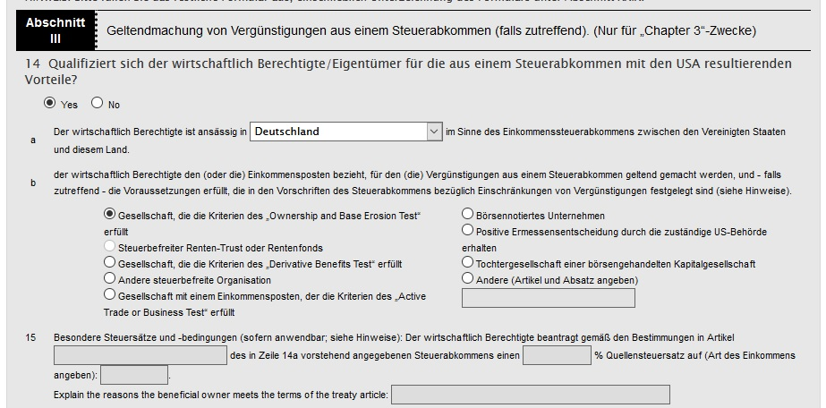

Informationen zur GmbH
----------------------

- Werden Versicherungen benötigt?
   - [YouTube Unternehmerkanal: die 7 wichtigsten Versicherungen für Unternehmer und Selbständige](https://www.youtube.com/watch?v=RSUSuwplqu4)
   - Betriebshaftpflichtversicherung, Rechtsschutzversicherung, Cyberversicherung
- Ausscheiden/Insolvenz/Tod eines Gesellschafters
- 4 Gesellschafter, Satzung: Jede Beschlussfassung bedarf einer Mehrheit von mehr als 75 % der Stimmen. So hat jeder von Ihnen ein Vetorecht.
   - <https://www.wista-ag.de/sozialversicherungsrechtlicher-status-von-minderheitsgesellschafter-geschaeftsfuehrern-in-familiengesellschaften/>
- in der Satzung kann geregelt werden (Vorlagen durch den Notar):
   - zu Geschäftsführungsbefugnissen
   - zu den besonderen Befugnissen der Gesellschafterversammlung einschließlich der Vereinbarung von Zustimmungserfordernissen
   - zur Ergebnisverwendung und der Gewinnverteilung
   - zu Zustimmungserfordernissen zu Veräußerung oder Belastung eines Geschäftsanteils
   - zu Andienungspflichten und Vorkaufsrechten
   - zu Wettbewerbsverboten
   - der Ausschließung von Gesellschaftern, der Einziehung von Geschäftsanteilen sowie die Abfindung von Gesellschaftern
   - zur Rechtsnachfolge in Geschäftsanteile auch im Wege der Gesamtrechtsnachfolge, z.B. Erbfolge
- Musterverträge
   - [IHK Köln Mustersatzung](https://ihk-koeln.de/upload/Broschuere_GmbH_Mustersatzung_2012_23302.pdf)
   - [Musterverträge der IHK München](https://www.ihk-muenchen.de/de/Service/Recht-und-Steuern/Vertragsrecht/mustervertraege/)
   - <https://www.iprecht.de/Anwalt/Muster/Mustervertraege/mu_gmbh/mu_gmbh.htm>
- Ist die UG Umsatzsteuerlicher Unternehmer i.S.v. § 2 UStG? Nachhaltige Tätigkeiten außerhalb der Aktienanlage mit Einnahmeerzielungsabsicht.
  -> Umsatzsteuerliche Einstufung als Kleinunternehmer oder nicht.
   - [Wikipedia: Kleinunternehmerregelung](https://de.m.wikipedia.org/wiki/Kleinunternehmerregelung_(Deutschland))
   - <https://www.gruenderlexikon.de/checkliste/informieren/ihr-recht/kleinunternehmerregelung/>
- Mein Finanzamt hat mir mit Verweis auf Umsatzsteueranwendungserlass (UStAE) Abschnitt 2.3 Abs. 1a erklärt,
   dass das bloße Erwerben, Halten und Veräußern von gesellschaftsrechtlichen Beteiligungen keine unternehmerische Tätigkeit im Sinne des Umsatzsteuergesetzes ist.
   Für deine Spardosen GmbH brauchst du daher keine Umsatzsteuervoranmeldungen oder Umsatzsteuererklärungen abzugeben, kannst aber auch im Umkehrschluss keine Vorsteuer abziehen.
   - <https://www.bundesfinanzministerium.de/Content/DE/Downloads/BMF_Schreiben/Steuerarten/Umsatzsteuer/Umsatzsteuer-Anwendungserlass/2019-12-31-umsatzsteuer-anwendungserlass-konsolidierte-fassung-31-12-2019.pdf?__blob=publicationFile&v=4>
- Gehalt des Geschäftsführers ist eine Betriebsausgabe (und kommt daher aus dem unversteuerten Gewinn und
  ist daher nach dem Zurückzahlen von Darlehen oft die beste Methode für eine Auszahlung aus der GmbH heraus)
   - dieser zahlt darauf Einkommensteuer, aber keine Sozialversicherungsbeiträge (als Selbständiger, gilt
     auf jeden Fall bei mehr als 50 % Anteil vom Geschäftsführer an der GmbH)
      - <https://www.gmbh-guide.de/sozialversicherungspflicht-geschaeftsfuehrer.html>
      - <https://www.gmbh-guide.de/sperrminoritaet-gmbh.html>
      - <https://www.youtube.com/watch?v=kuA1Pf1k4z8>
   - Lohnsteuer, <https://www.ilohngehalt.de/> <https://www.gruenderlexikon.de/checkliste/fuehren/lohnabrechnung/>
   - Gesellschafter-Geschäftsführer GGF
   - Lohnsteuer an den GGF fällt nur an, wenn mehr als 950 € Brutto-Gehalt ausgezahlt wird. In der Einkommensteuererklärung
     wird dies als Einkünfte aus selbständiger Arbeit eingetragen.
      - <https://www.lohn-info.de/lohnsteuersteuertabellen_2019.html>
      - <https://www.bmf-steuerrechner.de/>
   - Beim Gehalt muss darauf geachtet werden, dass es einem Fremdvergleich standhält, nicht, dass das
     Finanzamt eine verdeckte Gewinnausschüttung (VGA) daraus macht.
   - Unentgeltliche Geschäftsführung wird durch einen Gesellschafterbeschluss dokumentiert.
   - <https://www.wista-ag.de/verbilligte-ueberlassung-von-gmbh-anteilen-als-arbeitslohn-2/>
   - <http://mit-rueckenwind.info/anstellungsvertrag-geschaeftsfuehrer-spardosen-gmbh/>
- Veränderungen wie bspw. eine [Kapitalerhöhung](https://de.wikipedia.org/wiki/Kapitalerh%C3%B6hung),
  die Veränderung des Geschäftszwecks oder Änderungen der Gesellschafter sind dem Handelsregister (über einen Notar) mitzuteilen.
- Wird mehr als 25.000 € Stammkapital eingezahlt, wird dies als Kapitalrücklage gebucht. Besser ist eine Einbringung als Darlehen.
   - Darlehen kann jederzeit zurückgezahlt werden. Braucht keinen Gesellschafterbeschluss. Darlehen muss übliche Verzinsung aufweisen.
   - Gesellschafter Rahmen-Darlehen
      - [YouTube RIDE: Rahmendarlehensvertrag](https://www.youtube.com/watch?v=Kfx8MFl8Jh0)
   - Darlehen als "nachranig" vereinbaren: <https://mit-rueckenwind.info/vermoegensverwaltende-gmbh-finanzierung/#comment-495>
- Gesellschafterversammlung einmal im Jahr
- LEI-Nummer muss jährlich bezahlt werden (130 € am Anfang, dann 70 € pro Jahr)
   - <https://lei.info/portal/faqs/>
   - <https://de.wikipedia.org/wiki/Legal_Entity_Identifier>
      - <https://lei-codes.de/#/providers/DE>
      - <https://lei.bloomberg.com/> ($65 und dann $50/Jahr)
      - <https://leiservice.com/germany> (39 €/Jahr, 175 € für 5 Jahre)
      - <https://www.wm-leiportal.org/>
      - <https://www.kvk.nl/english/how-to-register-deregister-and-report-changes/legal-entity-identifier-lei/> (65 € excl. VAT, dann 40 € excl. VAT)
      - <https://www.lei.direct/> (89 €, dann 59 €/Jahr)
      - <https://www.leireg.de/>
      - <https://www-en.kdd.si/> <https://storitve.kdd.si/lei/en/index>
      - <https://www.gleif.org/de/lei/search>
   - Für Privatkunden ist ab dem 03.01.2018 für den Wertpapierhandel statt einer LEI eine CONCAT erforderlich.
     Diese wird wohl auf Basis der steuerlichen Id-Nr. vergeben und vom Broker automatisch beantragt.
      - <https://de.wikipedia.org/wiki/CONCAT>
- Gründungszuschuss von der Arbeitsagentur prüfen (nennt sich "Einstiegsgeld")
   - ermessenslenkenden Weisungen für den Zuschuss nach §16b SGB II und das Einstiegsgeld
   - Gründerzuschüsse sind steuerfrei nach § 3 Nr. 2 EStG und sie unterliegen nicht dem Progressionsvorbehalt und auch
     keinen anderen Einkunftsarten. Sie werden bei der Einkommensteuererklärung nicht berücksichtigt.
- aktuell bestehende Arbeitsverträge prüfen, ob dort Klauseln bestehen, die einer Gründung entgegen stehen (sollte selten der Fall sein)
   - eventuell bestehende Arbeitgeber über Neugründung informieren
   - Auf Anfrage bei einem AG im öffentlichen Dienst (Vorgaben nach dem Bundesbeamtengesetz) habe ich folgende Rückmeldung erhalten:
     Die Verwaltung des eigenen Vermögens fällt unter genehmigungsfreie Nebentätigkeiten. Dadurch wird dem Gesichtspunkt Rechnung getragen,
     dass eine nicht gegen anderweitige Pflichten verstoßende Verwaltung des eigenen Vermögens zum grundrechtlich geschützten Gebrauch des
     Eigentums (Art. 14 Abs. 1 GG) gehört. Es gibt keine Regelung zu der Form der Vermögensverwaltung. Die Tätigkeit ist auch nicht anzeigepflichtig.
- Welche Gebühren werden von Brokern für GmbHs erhoben?
   - Nicht alle Broker erlauben eine GmbH als Kunden.
   - Für Broker in Deutschland: Erlaubt der Broker sich von der Kapitalertragssteuer befreien zu lassen?
      - Werden die Teilfreistellungen nach dem Investmentsteuergesetz mit dem richtigen Prozentsatz berechnet und nicht dem für Privatanleger?
   - Gebühren für Professionals bei IB: <https://www.interactivebrokers.eu/de/index.php?f=15537>
- Geschäftskonto:
   - [Fyrst](https://www.fyrst.de/konten/), [Fidor Bank](https://fidor.de/), [PENTA](https://getpenta.com/de/firmenkonto/), [Holvi](https://www.holvi.com/),
     N26 (keine Geschäftskonten?), [Deutsche Bank](https://www.deutsche-bank.de/gk/zahlungsverkehr/zahlungsverkehr-im-ueberblick/geschaeftskonto.html),
     [Kontist](https://kontist.com/), [Skatbank](https://www.skatbank.de/geschaeftskunden/geschaeftskonto/kontomodelle/trumpfkonto_business.html),
     [Grenke](https://www.grenke.de/produkte/konten/business),
     [Revolut](https://business.revolut.com/), [FINOM](https://finom.de/),
     [qonto](https://qonto.com/),
     [VWFS](https://www.vwfs.de/geschaeftskunden/geldanlage.html)
   - Kreditkarte für das Geschäftskonto? Mastercard bei Interactive Brokers?
      - In Deutschland sind vor allem die Santander 1plus VISA-Card, die Barclaycard Visa und die DKB Cash Visa sehr beliebt.
      - <https://www.gebuhrenfrei.com/>
      - <https://www.n-tv.de/ratgeber/Nur-eine-Karte-ist-ohne-Tuecken-kostenlos-article21849133.html>
      - <https://finanz-szene.de/payments/die-acht-pricing-strategien-im-kartengeschaeft-deutscher-banken/>
   - <https://www.kontofinder.de/girokonto/business>
   - <https://verbraucher.eu/geschaeftskonto/>
   - <https://unternehmerkanal.de/geschaeftskonto-vergleich/>
      - [YouTube Unternehmerkanal: Firmenkonto](https://www.youtube.com/watch?v=e4n52UgNn1o)
   - Für einen Faktencheck zu Online-Banken ganz gut: <https://finanz-szene.de/>
      - Oder Kreditkarten: <https://finanz-szene.de/payments/die-acht-pricing-strategien-im-kartengeschaeft-deutscher-banken/>
- Buchhaltung:
   - Anforderungen an die Buchhaltung:
      - doppelte Buchführung, SKR04
      - Buchbare Konten für Aktien, Dividenden und Quellensteuern, Termingeschäfte, Zinsen, Währungsgewinne,
        atypisch stille Einlagen, individuell konfigurierbare Konten
      - DATEV-Schnittstelle für eine Übertragung zum Steuerberater (DATEV Connect Online)
      - ELSTER-Schnittstelle zum Finanzamt
         - Umsatzsteuervoranmeldungen
      - Export nach GDPdU für eine digitale Betriebsprüfung vom Finanzamt
      - Lässt sich ein Jahresabschluss selbständig erstellen/übertragen? Bzw. zusammen mit <https://www.myebilanz.de/> erstellen?
         - Selbst bei Unterstützung von doppelter Buchhaltung gehen die meisten Software-Programme davon aus, dass alle
           Buchungen nur vorbereitend erfasst werden und ein Jahresabschluss vom Steuerberater mit anderer Software erstellt wird.
      - Veröffentlichung im eBundesanzeiger wird unterstützt?
      - Zusammenarbeit Bank und Buchhaltung:
         - [finAPI](https://www.finapi.io/) ist ein Dienstleister der DATEV, <https://www.pleo.io/>
         - Eingesetzte Technik: CSV, [MT940-Format](https://de.wikipedia.org/wiki/MT940), [SWIFT-Nachricht](https://de.wikipedia.org/wiki/SWIFT-Nachricht), [ISO 20022](https://de.wikipedia.org/wiki/UNIFI_(ISO_20022)), [FinTS](https://de.wikipedia.org/wiki/Financial_Transaction_Services), [HBCI](https://de.wikipedia.org/wiki/Homebanking_Computer_Interface), [EBICS](https://www.ebics.de/) bzw. [Wikipedia: EBICS](https://de.wikipedia.org/wiki/Electronic_Banking_Internet_Communication_Standard)
            - [Banken-APIs](https://www.heise.de/hintergrund/Neue-und-alte-Banken-APIs-eine-Uebersicht-4907369.html)
         - Werden Umsätze der Bank/Kreditkarte in die Buchhaltung übernommen?
         - Können Banküberweisungen in Auftrag gegeben werden? (SEPA)
      - Online-Zugang und per App (iOS und Android)
      - Cloud-Belegablage mit Buchungsverknüpfung statt Papierbelegablage
   - Software
      - [Monkey Office der Firma ProSaldo](https://www.monkey-office.de/products/monkeyoffice/index.html)
      - [Kontolino](https://www.kontolino.de/)
         - <https://twitter.com/kontolino>
         - <https://www.provenexpert.com/de-de/kontolino/>
         - <https://www.kontolino.de/arbeitshilfen/>
         - <https://www.kontolino.de/muster-verfahrensdokumentationen-fuer-kontolino-nutzer/>
         - <https://www.kontolino.de/handbuch/jahresabschluss/handelsbilanz-erstellen/>
      - [Agenda Rechnungswesen](https://www.agenda-software.de/unternehmen/rechnungswesen-software.php)
   - Reviews Buchhaltungssoftware:
      - <https://www.rechnungswesen-portal.de/Marktplatz/Software/Finanzbuchhaltung/>
      - <https://www.buchhaltungssoftware.com/>
      - <https://www.fuer-gruender.de/fileadmin/mediapool/Unsere_Studien/PDF-Vergleich-Buchhaltungssoftware-2021_update.pdf>
   - Sammlung weiterer Buchhaltungssoftware:
      - [Taxpool-Buchhalter Bilanz](https://www.taxpool.net/bestellen/taxpool-buchhalter-bilanz.html)
      - [Sage Buchhaltung Start für 8 € pro Monat](https://www.sage.com/de-de/sage-business-cloud/buchhaltung/)
         - Bilanz- und GuV-Auswertung entsprechen nicht dem aktuellen HGB-Stand.
         - [Bilanzrichtlinie-Umsetzungsgesetz (BilRUG)](https://de.wikipedia.org/wiki/Bilanzrichtlinie-Umsetzungsgesetz) in der GuV-Gliederung wird nicht umgesetzt.
         - "Buchhaltung Start" hat kein DATEV-Export
         - Sage ist ein ERP, Sage Business Cloud liefert nur Buchhaltung.
      - [Banana Buchhaltung](https://www.banana.ch/)
      - [Textbuch doppelte Buchführung](http://www.textbuch.de/)
      - [DATEV Faktura](https://www.datev.de/web/de/datev-shop/komplettloesungen/datev-mittelstand-faktura-pro/)
      - [lexoffice](https://www.lexoffice.de/)
      - Lexware buchhaltung: Financial Office Premium
         - <https://www.lexware-financial-office.de/>
      - [Reviso](https://www.reviso.com/)
      - WISO Buchhaltung 365
      - [WISO Mein Geld](https://update2.buhl-data.com/documents/Leistungsuebersicht_Mein_Geld_2020.pdf)
         - <http://update1.buhl-data.com/Presse/Factsheets/Leistungs%C3%BCbersicht_Bankingsoftware.pdf>
         - <http://update2.buhl-data.com/Presse/Factsheets/tax_2020_business.pdf>
      - <https://sevdesk.de/>
      - [Debitoor](https://debitoor.de/) (reicht nicht aus)
      - [Collmex Buchhaltung](https://www.collmex.de/buchhaltung_software.html)
      - [Buchomat](https://ms-buchhalter.de/buchomat/)
      - [GetMyInvoices](https://getmyinvoices.com/) für Belege im Geschäft
      - <https://www.buchhaltungsbutler.de/>
      - <https://www.billomat.com/>
      - <https://www.weclapp.com/de/buchhaltungssoftware/>
      - <https://www.invoiz.de/>
      - <https://www.papierkram.de/>
      - <https://rechnungxxl.de/>
      - [freeFiBU](https://www.freefibu.de/)
- Verfahrensdokumentation nach GoDB
   - Die Mindestanforderungen an eine Buchführung sind im § 239 HGB geregelt.
   - [BMF-Schreiben zur GoBD](https://www.bundesfinanzministerium.de/Content/DE/Downloads/BMF_Schreiben/Weitere_Steuerthemen/Abgabenordnung/2019-11-28-GoBD.pdf?__blob=publicationFile&v=13)
   - <https://www.haufe.de/steuern/kanzlei-co/muster-verfahrensdokumentation-zur-belegablage_170_325034.html>
   - <https://www.bstbk.de/downloads/bstbk/steuerrecht-und-rechnungslegung/fachinfos/BStBK_GoBD_Ein-Praxisleitfaden-fuer-Unternehmen_Version-1.1_2018.pdf.pdf>
   - <https://www.haufe.de/steuern/steuer-office-basic/muster-verfahrensdokumentation-zum-ersetzenden-scannen_idesk_PI27_HI13546001.html>
   - <https://www.dstv.de/fuer-die-praxis/arbeitshilfen-praxistipps>
   - <https://www.awv-net.de/themen/fachergebnisse/musterverfahrensdoku/index.html>
   - <https://www.steuerschroeder.de/Verfahrensdokumentation.html>
   - <https://teamdrive.com/gobd/>
   - [ecoDMS](https://www.ecodms.de/index.php/de/)
   - [CompuDMS](https://www.compukoeln.de/produkte/compudms.html)
   - Datev Unternehmen Online
   - [YouTube: Verfahrensdokumentation nach GoBD: Udo Heimann](https://www.youtube.com/watch?v=IWNh8mr4gOk)
- Online Links zur Buchhaltung
   - <https://www.weclapp.com/de/blog/doppelte-buchfuehrung-einfuehrung/>
   - <https://www.collmex.de/einfuehrung_buchhaltung.html>
- <https://www.numbrs.com/de-de/>
- Macht ein Firmenaccount von Google G Suite Sinn?
   - <https://gsuite.google.com/intl/de/solutions/small-business/>
   - <https://gsuite.google.com/intl/de/pricing.html>
- Gewerbe oder freier Beruf? <https://eap.brandenburg.de/web/sbb/taetigkeitssuche>
- Beratung zu Steuerfragen:
   - IHK
   - <https://www.yourxpert.de/>
   - <https://www.maw-united.com/de/die-gebuehren-des-steuerberaters.html#Zwei>
- [Wikipedia: Steuernummer](https://de.wikipedia.org/wiki/Steuernummer#Aufbau_der_Steuernummer)
- Betriebsprüfungen:
   - <https://www.kontolino.de/die-betriebspruefung/>

Betriebsausgaben
----------------

- <https://www.lexware.de/wissen/buchhaltung-finanzen/betriebsausgaben/>
- Firmenwagen
   - mehr als 50 % komplett absetzbar, >10 % teilweise absetzbar, unter 10 % gar nicht
   - <https://www.nettolohn.de/rechner/firmenwagenrechner.html>
   - [Steuer-Webinar: Firmenwagen](https://www.youtube.com/watch?v=ukM59B8bu-o)
- Fahrtkosten tatsächlich oder pauschal absetzen
   - <https://www.adac.de/infotestrat/autodatenbank/autokosten/autokosten-rechner/default.aspx>
   - <https://www.adac.de/_mmm/pdf/autokostenuebersicht_47085.pdf>
- Bewirtungskosten
   - [Steuer-Webinar: Geschäftsessen](https://www.youtube.com/watch?v=k3_5uAL41F0)
- Verpflegungsmehraufwand
- Arbeitsmittel: müssen zu 90 % betrieblich genutzt werden
   - Computer und Software
- Telefon- und Internetkosten (als Betriebskosten)
- Arbeitszimmer
   - [Steuer-Webinar: häusliches Arbeitszimmer](https://www.youtube.com/watch?v=LWaXqerHnCc)
- Kosten für eine Webseite
- Werbungskosten
- Literatur- und Fortbildungskosten
   - Bücher, Zeitschriften mit Bezug zum Unternehmen
- Spenden und Sponsoring (für wirtschaftlich erzielbaren Vorteil)
- Geschenke, Zuwendungen und Provisionen
   - für nicht-Arbeitnehmer nicht mehr als 35 Euro
- Ausgaben vorziehen oder Verschieben
- Leasingraten können steuermindernd berücksichtigt werden (inklusive Sonderzahlungen)
- Lagerbestand, Software kaufen, Computer/Hardware/Infrastruktur
- bis 150 Euro als Betriebsausgabe buchbar, unter 410 Euro Netto Geringwertiges Wirtschaftsgut (beweglich, abnutzbar, selbständig nutzbar) im Jahr komplett buchbar
   - sonst AFA auf mehrere Jahre
   - Die geringwertigen Wirtschaftsgüter mit Anschaffungskosten bis 800 € werden gem. § 6 Abs. 2 EStG im Jahr der Anschaffung voll abgeschrieben.
- Steuerfreie Zuwendungen an Arbeitnehmer
   - <https://www.finanztip.de/steuerfreie-sachzuwendungen/>
   - 44 € Sachbezüge pro Monat (ab 2022: 50€/Monat)
      - Umsetzbar ist dies bspw. über den [SODEXO Benefits Pass](https://www.sodexo.de/produkte/benefits-pass/), mit dem man
        sogar seine normalen Einkäufe bezahlen kann (bspw. Aldi, Kaufland, Thalia, ...).
   - 60 € Sachbezug für besondere persönliche (!) Anlässe (bspw. Geburtstag; gilt nicht bei Weihnachten oder Ostern)
   - Maximal 2x jährlich eine Betriebsveranstaltung für 110 EUR pro Teilnehmer
      - <https://www.haufe.de/personal/haufe-personal-office-platin/betriebsveranstaltung-55-kosten-fuer-begleitpersonen_idesk_PI42323_HI2330506.html>
      - Pro betrieblichen Teilnehmer stehen 110 EUR zur Verfügung und es darf jeder betriebliche Teilnehmer in Begleitung erscheinen.
   - [Lohnsteuer: Gehaltsumwandlungen ab 2020](https://www.youtube.com/watch?v=LW_IEspo8cU)

Herausnahme von Kapital aus der GmbH
------------------------------------

- Darlehensrückzahlung: ganz ohne Steuern (nur Zinszahlungen während dem Darlehen)
- Darlehenszinsen (Fremdkapitalzinsen)
- Darlehen von der GmbH bekommen.
- <https://www.lexoffice.de/lexikon/beteiligungen/>
- Gehalt
   - Lohnsteuer muss gezahlt werden.
   - Für den GF sozialabgabenfrei.
- Gewinnausschüttung ([YouTube Christoph Juhn: Gewinnausschüttung einer GmbH](https://www.youtube.com/watch?v=hnjQMGZ88mY)):
   - Standardverfahren: Kapitalertragsteuer(KapESt)/Abgeltungsteuer(25 %) + SolZ = 26,375 %
   - [Teileinkünfteverfahren](https://de.wikipedia.org/wiki/Teileink%C3%BCnfteverfahren)
     mit 40 % steuerfrei und 60 % mit persönlichem Steuersatz (Einkommensteuer)
      - Teileinkünfteverfahren lohnt sich immer dann, wenn der persönliche Steuersatz unter 42 % liegt,
        ansonsten sind die Steuerbeträge fast gleich.
      - Teileinkünfteverfahren muss bei Abgabe der Steuererklärung beantragt werden.
      - Kann nur bei mindestens 1 % Beteiligung für den GF geschehen oder mindestens 25 % für Gesellschafter.
      - Beim Teileinkünfteverfahren darf man dann auch 60 % der Werbungskosten bei der ESt geltend machen, bei der KapESt gibt es nur den Sparerpauschbetrag.
      - <https://www.wista-ag.de/wahlrecht-zum-ausschluss-des-abgeltungsteuersatzes-auf-gewinnausschuettungen-bei-beteiligung-und-beruflicher-taetigkeit-fuer-die-gmbh/>
- Grundfreibetrag pro Person von 9.000 € steuerfreien Einkünften pro Jahr.
  Im § 32d Abs. 2 Nr. 3 EStG kann man anstelle der Abgeltungssteuer zu einem
  Teileinkünfteverfahren optieren, bei dem nur 60 % der Einkünfte zu versteuern sind.
  9.000 € pro Jahr / 60 % = 15.000 € pro Jahr = 1.250 € pro Monat pro Person.
  Wenn man als Ehepaar und die Kinder eingetragen ist, kann hier die Ausschüttungsquote erhöht werden.
  2019 ist der Freibetrag 9.168 €, 2020 9.408 €, 2021 9.744 € und 2022 9.984/10.347 €.
- Dem Kind steht für Kapitalerträge nicht nur der Sparerpauschbetrag von 801 € zu, sondern
  auch der Grundfreibetrag von 8.130 € sowie der Sonderausgabenpauschbetrag von 36 €. Damit kann jedes Kind
  mindestens 8.967 € Zinsen steuerfrei kassieren.
   - Sind die Kinder nicht in einer PKV (Privaten Krankenversicherung) sondern in der gesetzlichen
     Krankenversicherung bei den Etern mitversichert, dann dürfen die Familienmitglieder maximal 450 € / Monat
     verdienen. Über den 450 € * 12 = 5400 € / Jahr müssen sich die Kinder selber freiwillig versichern.
- Kapitalherabsetzung: benötigt einen Gesellschafterbeschluss + Notar
- Als Mini-Jobber für die Gesellschaft anstellen, damit man krankenversichert ist. (?)
- Kostenerstattung, Honorartätigkeiten
- Dienstleistungen (Kleinunternehmer bis 22.500 €)
- [Wikipedia: Rücklage](https://de.wikipedia.org/wiki/R%C3%BCcklage)
   - [Gewinnrücklage](https://de.wikipedia.org/wiki/Gewinnr%C3%BCcklage)
   - <http://www.daswirtschaftslexikon.com/d/r%C3%BCcklagen/r%C3%BCcklagen.htm>
- Altersversorgungszusage, für die in der Bilanz eine Pensionsrückstellung gebildet wird. Rücklagen für Rentenzahlungen.
   - [Wikipedia. Pensionsrückstellung](https://de.wikipedia.org/wiki/Pensionsr%C3%BCckstellung)
   - Eine bAV (betriebliche Altersvorsorge) ist nur nach Probezeit5 (5 Jahre GmbH und 3 Jahre GGF) möglich.
     Pensionszusagen ohne Aktiv Bezüge sind nicht möglich. Mit Bezügen muss die Angemessenheit (max 75%) jederzeit gewährleistet sein.
     Auch die Erdienbarkeit und das Höchsteintrittsalter sind zu beachten.
   - Pensionszusagen gelten als zu starr und es gibt zu viele Vorschriften dazu, daher sollten sie eher vermieden werden.
- Rückstellungen für:
   - [Wikipedia: Rückstellung](https://de.wikipedia.org/wiki/R%C3%BCckstellung)
   - Investitionsabzugsbeträge (Anschaffungen in den nächsten 3 Jahren)
      - 40 % bereits ein Jahr vorher buchen
   - nicht genommener Urlaub, Gehälter, Jahresabschluss, IHK-Beitrag, Aufbewahrung von Geschäftsunterlagen, Energiekosten

Links:

- [YouTube Juhn: 5 Steuervorteile der GmbH](https://www.youtube.com/watch?v=eu29ZYehds8)

Besteuerung von Börsen-Gewinnen und -Verlusten
----------------------------------------------

Wie werden Aktien-, Dividenden- und Termingeschäfte einer GmbH steuerlich behandelt?

- Aktien
   - 5 % vom Veräußerungsgewinn werden als nicht abziehbare Betriebsausgaben dem Gewinn
     hinzugerechnet. Aktienverluste bleiben unberücksichtigt. Damit sind Aktiengewinne zu 95 %
     von der Steuer befreit ([§ 8b Abs. 2 Satz 1 KStG](https://dejure.org/gesetze/KStG/8b.html)).
   - Aktiengewinne werden nur zu 5 % versteuert: Dort fällt KSt+SolZ und GewSt an. Also werden 5 % mit 15,825 % und GewSt versteuert.
      - Das entspricht 0,79125 % Steuer ohne GewSt oder ca. 1.6 % bei üblicher GewSt. (5 % * 15,825 % + 5 % * 14 % = 1,5 %).
- Termingeschäfte haben einen eigenen Verlustverrechnungstopf: Verluste von Termingeschäften lassen
  sich nur mit Gewinnen aus Termingeschäften verrechnen.
   - § 15 Abs. 4 S. 3 EStG: Verluste sind nicht abzugsfähig
- Dividenden und alle anderen Wertpapiere: KSt+SolZ+GewSt, Verluste werden voll angerechnet. Dies gilt für die KSt bei Streubesitz von
  weniger als 10 % und für die GewSt bei Streubesitz von weniger als 15 %. (§ 8b Abs. 4 KStG.)
   - Dividenden nicht aus dem Streubesitz werden wie Aktien versteuert.
   - Gezahlte Quellensteuer wird bis 15% auf die Körperschaftsteuer angerechnet. Hängt vom jeweiligen Land ab.
- Vorabpauschale für Fonds
   - <https://www.ebnerstolz.de/de/investmentsteuerreformgesetz-stolpersteine-bei-betrieblichen-anlegern-261044.html>
- Teilfreistellungen nach [§ 20 1 InvStG](https://www.gesetze-im-internet.de/invstg_2018/__20.html):
   - Steuerfrei sind bei Aktienfonds 80 % der Erträge. Bei der Ermittlung des Gewerbeertrags nach § 7 des Gewerbesteuergesetzes
     sind die Freistellungen nur zur Hälfte zu berücksichtigen.
      - Beispiel: 20 % * 15,825 % = 3,165 % Körperschaftssteuer und ca. 60 % * 15 % = 9 % Gewerbesteuer. Zusammen macht das ca. 12,165 % Ertragssteuern.
      - Teilfreistellungen für KSt und GewSt für:
         - Aktienfonds (> 51% Aktien): 80%, 40%
         - Mischfonds (25-50% Aktien): 40%, 20%
         - Renenfonds: 0%, 0%
         - Immobilienfonds: 60%, 30%

Links:

- [Allianz Global Investors: Steuern für Privat- und Firmenanleger](https://de.allianzgi.com/de-de/service/steuern)
- <https://de.wikipedia.org/wiki/Schachtelprivileg>
- <https://www.haufe.de/finance/finance-office-professional/beteiligung-an-anderen-koerperschaften_idesk_PI11525_HI1542614.html>
- <https://www.smartsteuer.de/online/lexikon/s/steuerbefreiungen-gem-kstg/#D063101600035>

Firmenkonto bei Interactive Brokers
-----------------------------------

Das Eröffnen eines Firmenaccounts bei Interactive Brokers ist recht aufwendig. Zudem muss anstelle von dem
W-8BEN-Formular für Privatpersonen das W-8BEN-E-Formular ausgefüllt werden:

- <https://dev.dp.fxflat.com/fileadmin/media/content/Anleitungen_TWS/Anleitung_TWS_Firmenkonto.pdf>
- <https://wissen.ride.capital/knowledge/wie-f%C3%BClle-ich-ein-w-8ben-e-formular-aus>
- [Interactive Brokers:Non-US Steuerinformationen](https://www.interactivebrokers.eu/de/index.php?f=16583&p=nonus)
- Keine Umlaute oder ß bei IB eingeben, anstelle von ö oe verwenden. Ansonsten werden die Eingaben abgelehnt.
   - Beim Kontoeröffnungsantrag muss beim Geschäftszweck "Vermoegensverwaltung" eingetragen werden.
- <https://ibkr.info/article/2629>
- <https://www.irs.gov/pub/irs-pdf/iw8.pdf>
- [IHK Stuttgart: W-8BEN-E](https://www.stuttgart.ihk24.de/fuer-unternehmen/recht-und-steuern/steuerrecht/internationales-steuerrecht/neues-w-8ben-e-formulare-fuer-unternehmen-684858)
- [IHK Nürnberg: W-8BEN-E](https://www.ihk-nuernberg.de/de/media/PDF/International/formular-w-8ben-e-.pdf)
- [IHK Koblenz: W-8BEN-E](https://www.ihk-koblenz.de/international/usa-kompetenzzentrum/steuerrecht-3450714)
- [Investopedia: W-8](https://www.investopedia.com/terms/w/w8form.asp)
- TIN (Tax Ident Number) ist die normale Steuernummer der GmbH
- Bei einer reinen Holding ohne operatives Geschäft: passive NFFE = passive non financial foreign entity,
  wenn die GmbH auch Consulting oder anderes anbietet ist active NFFE richtig.
- "Gesellschaft die die Kriterien des Ownership and Base Erosion Test erfüllt" bzw. "Company that meets the ownership and base erosion test":  
   
- (alter Eintrag, muss wohl doch nicht verwendet werden: Doppelbesteuerungsabkommen: company that meets the derivative benefit test)
- Von einem "Friends und Family Gruppen Konto" bei Interactive Brokers kann man bis zu 15 Konten betreuen.
  Wenn man dieses als Privatperson eröffnet und eine Einladung zur Verwaltung an das GmbH-Konto verschickt,
  kann man von dort mit dem privaten Daten-Abo die Orders für das GmbH-Konto aufgeben. (Funktioniert
  eventuell bei neuen Konten nicht mehr.)
- Verbinden von mehreren Konten auf einen Login: <https://www.interactivebrokers.co.uk/de/?f=22685>
- <https://wissen.ride.capital/knowledge/kontoer%C3%B6ffnung-bei-ib>
- <https://wissen.ride.capital/knowledge/wie-f%C3%BClle-ich-den-fx-flat-antrag-aus>
- <https://www.facebook.com/groups/479506939632634/permalink/590960791820581/>
- <https://www.interactivebrokers.com/lib/cstools/faq/#/articles/28222558>
- <https://www.bafin.de/DE/Aufsicht/BoersenMaerkte/Derivate/EMIR/emir_node.html>

Stille Gesellschaft
-------------------

- <https://de.wikipedia.org/wiki/Stille_Gesellschaft>
- <https://www.smartsteuer.de/online/lexikon/a/atypische-stille-gesellschaft/>
- <https://www.firma.de/firmengruendung/gmbh-still-motive-und-vorteile-stiller-gesellschafter-einer-gmbh/>
- <https://www.haufe.de/finance/finance-office-professional/stille-gesellschaft-3-gewerbesteuer_idesk_PI11525_HI6696685.html>
- <https://www.juhn.com/fachwissen/unternehmensbesteuerung/stille-gesellschaft/>
- <https://www.juhn.com/fachwissen/gmbh-steuerrecht/atypisch-stille-gesellschaft/>
  - <https://www.youtube.com/watch?v=QWdJBIlD2vA&t=7s>
- <https://www.juhn.com/fachwissen/gmbh-steuerrecht/stille-gesellschaft-steuervorteile/>
- <https://www.konlus.de/kanzleinachrichten/text/rechtsanwalt-steuerrecht-gewerbesteuer-atypisch-stille-gesellschaft.html>
- <https://www.lexoffice.de/lexikon/beteiligungen/>
- §§ 230-236 HGB, § 233 ff, § 705 ff Bürgerliches Gesetzbuch über die GBR
- Innengesellschaft
- keine Außenwirkung
- Wenn du die GmbH beim Finanzamt anmeldest, kann man auf dem Fragebogen zur steuerlichen Erfassung ankreuzen, dass eine atypisch Stille Beteiligung besteht.
- GmbH mit einem atypisch stillen Gesellschafter: Freibetrag zur Gewerbesteuer wird von der Privatperson
  auf die Gesellschaft übertragen. Es müssen mindestens 1 % der Gewinne an diese Person ausgeschüttet werden.
- Wenn man die Bilanz/Jahresabschluss vom Steuerberater machen lässt, dann sind die Ersparnisse durch eine stille
  Beteiligung (Gewerbesteuerfreibetrag) schnell wieder durch die Mehraufwendungen des Steuerberaters aufgebraucht.
- [BMF: Übermittlungspflicht atypisch stiller Gesellschaften](https://www.bundesfinanzministerium.de/Content/DE/Downloads/BMF_Schreiben/Steuerarten/Einkommensteuer/2017-11-24-e-bilanz-uebermittlungspflicht-in-faellen-atypisch-stiller-gesellschaften-gemaess-paragraf-5b-EStG.pdf?__blob=publicationFile&v=1)
- <https://www.wista-ag.de/angemessenheit-der-gewinnverteilung-bei-gmbh-mit-atypisch-stiller-beteiligung/>
- <https://www.gk-law.de/Stille-Beteiligungen/Stille-Beteiligungen-0317333755.html>
- Wir haben nun zwei Möglichkeiten für die Feststellungserklärung für die UG atypisch still durchzuführen:
   - richtig: Gesonderte und einheitliche Feststellung von Grundlagen für die Einkommensbesteuerung (ESt 1 B)
   - falsch: Gesonderte Feststellung von Grundlagen für die Einkommensbesteuerung (ESt 1 D)
- zu erstellende Unterlagen für eine atypisch stille Gesellschaft:
   - Handelsbilanz GmbH/UG & atypisch still
   - Steuerbilanz GmbH/UG & atypisch still
   - Steuerbilanz GmbH/UG -> für die Körperschaftssteuererklärung
- Die Errichtung einer atypisch stillen Beteiligung führt dazu, dass du eine gesonderte und einheitliche
  Feststellung machen musst, in der der Gesamtgewinn aufgeteilt wird zwischen der GmbH und dem Stillen.
  Der Gewinn aus dieser Feststellung unterliegt der Gewerbesteuer. Da die atypisch stille Beteiligung zu
  einer Personengesellschaft führt erhält man den Freibetrag auf die Gewerbesteuer. Der Stille sollte der
  Einfachheit halber keinerlei Vergütung erhalten außer eben seinen Anteil am Gewinn, da es sonst zu
  Sonderbilanzen und Aufwand führt.
- Sowohl die atypisch stille Gesellschaft als auch das Unternehmen, an dem die Beteiligung besteht, sind getrennt IHK-Mitglied und beitragspflichtig.

Vorsicht bei der Wahl des atypisch stillen Gesellschafters. Bloß nicht sich selber wählen, außer man weiß
ganz genau was man tut. Die Stille Beteiligung wird zu Sonderbetriebsvermögen, wenn der Stille auch
Stimmrechte an der GmbH hat. Das ändert die Besteuerung von allen Zahlungen der GmbH an die natürliche
Person. Geschäftsführergehalt ist dann nicht mehr als Betriebsausgabe absetzbar, für Gewinnausschüttungen
gilt die Abgeltungssteuer nicht, etc. Auch wer Frau oder Kind als Stillen wählt muss bedenken, dass die
Stille Gesellschaft wieder aufgelöst werden sollte, bevor man die GmbH Anteile vererbt. Denn in dem Moment
würden sie ggf. zu Sonderbetriebsvermögen werden beim Erben.

Stiftungen
----------

- <https://de.wikipedia.org/wiki/Stiftung_(Deutschland)>
- <https://nachfolgewiki.de/index.php/Familienstiftung>
- <https://www.stiftungen.org/>
- <https://mein-geldspeicher.de/>
- <https://immlab.de/deine-eigene-stiftung-gruenden/>
- [Familien- und gemeinnützige Stiftungen](https://www.youtube.com/watch?v=q4O4j2a_YAk)
- keine Gewerbesteuer, nur Körperschaftsteuer
- keine gewerbesteuerliche Infektion
- Immobilien können nach 10 Jahren steuerfrei veräußert werden (ähnlich zum Immobilienbesitz im Privatvermögen)
- einfache Einkommenüberschussrechnung statt Bilanz
- keine Publizitätspflicht
- Steuerfreibetrag von 5.000 € im Jahr
- Werbungskosten nicht abziehbar, aber Sparer-Pauschbetrag von 801 € wie bei Privatpersonen
- Privatnützige Familienstiftungen unterliegen u.U. der Schenkungssteuer.
- Alle 30 Jahre wird Erbersatzsteuer auf das Vermögen erhoben mit einem Freibetrag von 800.000 Euro.
   (Kann auf 30 Jahresraten aufgeteilt werden.)
- Keine Wegzugsbesteuerung
- Probleme mit der Verlustbegrenzung auf 20.000 € bei Termingeschäften wie bei Privatpersonen bleibt bestehen.
- Häufig wird eine Familienstiftung als Holding kombiniert mit einer VVGmbH für kurzfristigem Trading.
- Wie komme ich privat an Geld:
   - Gehalt
   - Darlehen
   - Ausschüttungen (25 % oder Teileinkünfteverfahren (60 % mit Einkommensteuer, 40 % steuerfrei))
      - Für Ausschüttungen an den Stiftungsvorstand muss die Stiftung die Kapitalerstragsteuer an das Finanzamt
        abführen, der Vorstand muss dann nichts mehr versteuern.
      - Für sonstige Ausschütungen an die Destinäre müssen diese in Ihrer Steuererklärung die Einnahmen
        als Sonstige Einkünfte mit dem Teileinkünfteverfahren versteuern.
      - Mit dem Teileinkünfteverfahren sind Ausschüttungen bis zu ca. 16.000 € pro Jahr "steuerfrei".
   - Verkauf/Vermietung von Vermögensgegenständen
- Einbringung von 100.000 € pro Person ohne Steuern(?)
   - Aktien können ohne vorherigen Verkauf eingebracht werden.(?)
- Stiftung zählt nicht mehr zur privaten Erbmasse

Holding
-------

- <https://www.companies24.com/6-fragen-zur-ug-als-holding-und-steuersparmodell/>

Beteiligung an einer GmbH:

- Dauerüberzahlerbescheinigung bei Kapitalertragsteuer (ähnlich einer Nichtveranlagungsbescheinigung):
  Wenn Kapitalerträge Betriebseinnahmen sind und die Kapitalertragsteuer dauerhaft höher ist als die gesamte
  festzusetzende Einkommen- oder Körperschaftsteuer, dann muss kein Steuerabzug vorgenommen werden.
   - Nach § 44a Abs. 5 EStG kann eine Bescheinigung vom Finanzamt an die operative GmbH gegeben werden,
     falls weniger als 25 % Abgeltungssteuer anfallen und damit nicht zu viel Steuern einbehalten werden.
   - Beispiel: Bei einer Holding müssen 25 % Steuern gezahlt werden, es fallen tatsächlich aber nur 1,5 % Steuern
     an. Die 23,5 % werden dann erst über eine Steuererklärung vom Finanzamt erstattet.
   - Um die Privilegierung zu nutzen, muss beim zuständigen Finanzamt eine Freistellungsbescheinigung gemäß
     § 44a Abs. 5 S. 4 EStG beantragt werden. Soweit die Kapitalertragsteuer schon einbehalten wurde, kann
     ein entsprechender Erstattungsanspruch geltend gemacht werden.
   - <https://www.youtube.com/watch?v=jkcLOYR4Xpg>
   - <https://www.juhn.com/content/uploads/2021/01/Antrag-auf-Nichtveranlagungs-Bescheinigung.pdf>

Immobilien
----------

- <https://www.youtube.com/watch?v=J81Saj6-OeM>

Wegzugsbesteuerung
------------------

Laut Wegzugsbesteuerung nach § 6 AStG § 17 EStG werden alle Gewinne fiktiv an die Gesellschafter ausgeschüttet.
Die Besteuerung beim Gesellschafter erfolgt unter Anwendung des Teileinkünfteverfahrens, wobei
40 % steuerfrei sind und 60 % nach dem persönlichen Steuersatz besteuert werden.

Aktueller Gewinn der Kapitalgesellschaft * 7 Jahre ist der fiktive Gewinn, der sofort zur Versteuerung fällig wird.

- <https://www.staatenlos.ch/>
- [Facebook: Staatenlos Mastermind](https://www.facebook.com/groups/906274769393425/)

Firma im Ausland gründen
------------------------

[YouTube Steuerberater Christoph Juhn: Firma im Ausland gründen](https://youtu.be/dBdhQYMkRVU)

Stuttgart
---------

Spezielle Links für alle, die in Stuttgart eine GmbH gründen wollen:

- [IHK Stuttgart: Firmenname-Recherche](https://www.stuttgart.ihk24.de/fuer-unternehmen/weitere-services/firmen/firmennamen-666050)
- [IHK Stuttgart Mitgliedsbeitrag](https://www.stuttgart.ihk24.de/ueber-uns/beitraege/asbeitrag-664170)
   - Für eine GmbH ist für das Jahr 2021 ein Grundbeitrag von 168 Euro und eine Umlage von 0,21 % des Gewerbeertrags zu zahlen.
     (Das sind bei 50.000 € Gewerbeertrag dann 105 € Umlage.)
- [Gewerbeanmeldung in Stuttgart](https://www.stuttgart.de/vv/leistungen/gewerbe-anmelden.php?p=1118%2C1561%2C%2Fservice%2Fdienstleistungen%2Findex.php%2C104840)
   - Ausgenommen davon sind: die ausschließliche Verwaltung eigenen Vermögens
   - <https://www.stuttgart.de/medien/ibs/gewerbeanmeldung.pdf>
   - Gewerbeanmeldung kostet 60 € (Stand 2021/05)
- Abfallgebühren: Abfallwirtschaftssatzung der Landeshauptstadt Stuttgart (AfS) zuletzt geändert am 5.12.2019 (Amtsblatt der Landeshauptstadt Stuttgart Nr. 50 vom 12.12.2019)
   - Abfallgebühren noch nicht nachgeschaut, online scheinen die nicht zu sein.

München
-------

Spezielle Links für alle, die in München eine GmbH gründen wollen:

- IHK Beitrag für aus atypisch stiller Beteiligung resultierender Personengesellschaft:
  laut <https://www.ihk-muenchen.de/beitrag/> wohl nur sofern Erträge (Zinsen, Ausschüttungen, ...) von mehr als 5.200 Euro anfallen.

